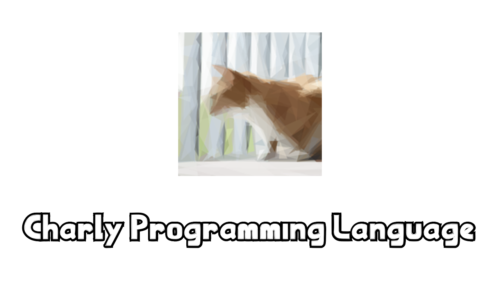
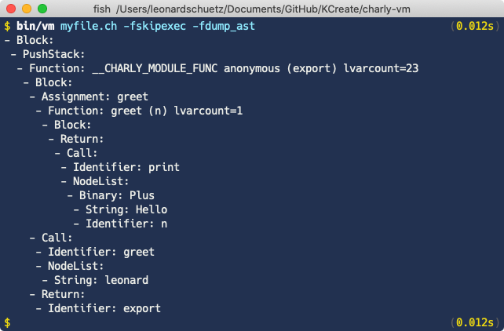
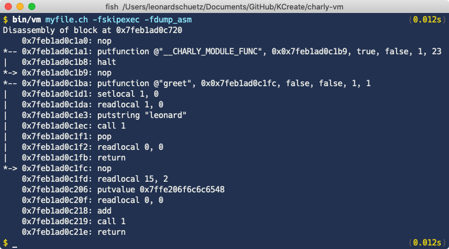

## What is Charly?

Charly is a programming language with the following goals:

- Syntax similar to JavaScript (Compatibility is not a goal)
- Easy way to write C extensions
- Single-threaded work-queue for charly code
- Async IO, multithreadable C code
- Small and simple standard library

Charly was not created with the intention of it being used as a production level language for anything important.
It's main purpose is to teach other programmers how to write the basic components of a programming language.
This includes the various stages of producing an Abstract Syntax Tree, how to perform manipulations on that tree
and finally how to generate bytecodes that can then be executed in a custom virtual machine.

Charly's implementation contains many interesting things, such as NAN-Boxing, a C-Module system using `dlopen`,
a computed-goto main-switch, a mark-and-sweep garbage collector and a single-threaded task-queue backed by an
asynchronous, multithreaded worker-queue.

## Example code

### Channels

```javascript
// Create a new channel
const c = new Channel()

// Writer loop
spawn(->{
  let i = 0
  loop {
    c.write(i)
    i += 1
  }
})

// Reader loop
spawn(->{
  loop {
    const msg = c.read()
    print("Message: " + msg)
  }
})

// Output:
// Message: 0
// Message: 1
// Message: 2
// Message: 3
// Message: 4
// ...
```

### Promises

The `spawn.promise` method is a shorthand for the regular `new Promise(->(resolve, reject) {...})` kind of way
to creating a promise. The created promise resolves once the callback returns or rejects
if the callback throws an exception.

```javascript
const p = spawn.promise(->"Hello world!", 1.second())

p.then(->(result) {
  print("Got result: " + result) // Got result: Hello world!
})
```

You can also synchronously wait for a promise to finish. This currently active
thread pauses and will resume once the promise resolves or throw an exception
if it gets rejected.

```javascript
const p = spawn.promise(->"Hello world", 1.second())

// The wait method returns the value the promise resolved with.
// If the promise got rejected, it will throw
const result = p.wait()

print(result) // "Hello world!"
```

### Turning asynchronous into synchronous flow

```javascript
// Implementation of the sleep method using standard library constructs
func sleep(duration) {

  // The Notifier allows the user to pause and
  // resume different threads of execution
  const n = new Sync.Notifier()

  // notify_one will resume one waiting thread
  spawn.timer(->n.notify_one(), duration)

  // Wait until we are notified to resume
  n.wait()
}

print("Hello")
sleep(1.second())
print("World")
```

### Closures
```javascript
// This function returns another function which, when invoked,
// will return the current value of the counter and add 1 to it
func create_counter {
  let i = 0

  return ->{
    const v = i
    i += 1
    return v
  }
}

const counter = create_counter()
counter() // => 0
counter() // => 1
counter() // => 2
```

### Exceptions
```javascript
try {
  throw "Hello World"
} catch(e) {
  e // => "Hello World"
}

try {
  // do some things here
} finally {
  // The `finally` handler gets invoked no matter if an exception has been caught or not

  print("Hello World")
}
```

### Classes
```javascript
class Greeter {
  property name

  greet {
    print("Good morning " + @name)
  }
}

class RudeGreeter extends Greeter {
  constructor(name) {
    super("stupid " + name)
  }

  greet {
    print("...oh no, not him again...")
    super()
    print("...now go away...")
  }
}

const greeter      = new Greeter("Leonard")
const rude_greeter = new RudeGreeter("Leonard")

greeter.greet()
// Good morning Leonard

rude_greeter.greet()
// ...oh no, not him again...
// Good morning stupid Leonard
// ...now go away...
```

### Tickers

```javascript
const t = spawn.ticker(->(i) {
  print("Iteration: " + i)
}, 250.ms())

t.then(->{
  print("Ticker iterations: " + t.iterations)
})

spawn.timer(->t.stop(), 2.seconds())
```

### Extending primitive classes

[Mocking Spongebob Meme](https://knowyourmeme.com/memes/mocking-spongebob)

```javascript
String.prototype.mockify = func {
  const sentence = self.lowercase()

  // Split the sentence into words
  const words = sentence.split(" ")

  // Change the case of each character
  let uppercase = false
  const mocked_words = words.map(->(word) {
    word.map(->(character) {
      if !uppercase { uppercase = true;  return character }
      if uppercase  { uppercase = false; return character.uppercase() }
    })
  })

  mocked_words.join(" ")
}

print("You should not use memes in example code".mockify())
// => yOu ShOuLd NoT uSe MeMeS iN eXaMpLe CoDe
```

## Teaching Features

Via the executable arguments, you can make the charly compiler print out various data structures that are being
produced during the compilation phase.

```javascript
func greet(n) {
  print("Hello " + n)
}

greet("leonard")
```

### Tokens


### Abstract Syntax Tree



### Bytecode



## Contributing

All contributions are welcome, no matter how small or big.

1. Fork it (https://github.com/KCreate/charly-vm/fork)
2. Create your feature branch (`git checkout -b my-new-feature`)
3. Commit your changes (`git commit -am "Add some feature"`)
4. Push to the branch (`git push origin my-new-feature`)
5. Create a new Pull Request

## Installation

You're going to need a Compiler supporting C++17.
I am currently using the `clang 10` compiler, I don't know if it works on other compilers.

1. `git clone http://github.com/KCreate/charly-vm`
2.  Build
	- Development: `make` or `make rebuild`
	- Production: `make production`
	- Profiled-Production: `make profiledproduction`
		- The `profiledproduction` method will first build a production binary.
      Using the optimized binary, it will execute the file
      `examples/runtime-profiler.ch`, which tries to touch every part of the
      language at least once. It then uses this profile to generate an even
      more optimized version. I currently don't have any benchmarks to prove
      this claim, so don't quote me on this.
3. Set the `CHARLYVMDIR` environment variable to the project's root folder
   `CHARLYVMDIR=/home/user/github/KCreate/charly-vm`
4. (Optional) Execute the unit-test suite to make sure everything works correctly
   `bin/charly test/main.ch`
6. Done!

## Executing unit tests

Execute the unit-test suite via `bin/charly test/main.ch`.
To disable stack traces in error messages add the `--hide-stacktraces` flag.

```
$ bin/charly test/main.ch
Charly Unit Testing Framework
........................................................................................................................................................................................................................................................................................................

All tests have passed
```

## Command-line options

```
$ bin/charly -h
Usage: charly [filename] [flags] [--] [arguments]
    -f FLAG, --flag FLAG             Set a flag
    -h, --help                       Print this help message
    -v, --version                    Prints the version number
    -l, --license                    Prints the license
    --vmdir                          Prints the CHARLYVMDIR environment variable

Flags:
    dump_ast                         Display the AST of the input file
    dump_tokens                      Display tokens of the input file
    dump_asm                         Display a disassembly of the input file
    dump_file_include filename       Add a file to the list of files to be dumped
    asm_no_offsets                   Don't display offsets in the disassembly
    asm_no_branches                  Don't display branches as arrows in the disassembly
    asm_no_func_branches             Don't display branches for PutFunction instructions
    skipexec                         Don't execute after parsing
    instruction_profile              Display a profile of all executed instructions
    trace_opcodes                    Display opcodes as they are being executed
    trace_catchtables                Display catchtables as they are being created or left
    trace_frames                     Display frames as they are being entered and left
    trace_gc                         Display statistics about the gc at runtime
    verbose_addresses                Display addresses of printed values, when applicable

Examples:

    Executing a file:
    $ charly file.ch

    Dumping generated bytecodes for a file:
    $ charly file.ch -fskipexec -fdump_asm

    Dumping generated AST for a file:
    $ charly file.ch -fskipexec -fdump_ast

    Disabling the cli-parser using '--'
    $ charly dump-argv.ch -- -fdump_asm -fskipexec
```

## Vim syntax highlighting & indent support

In the folder `vim_syntax_files` there are three files you can install into your local `.vim` folder to
gain some syntax highlighting and indentation support for vim. They are originally for the JavaScript language
but I modified them to suit my own needs. The original sources are linked at the top of the respective files.

## Credits

- [Leonard Schütz @KCreate](http://github.com/KCreate) Lead Developer

## Mentions

I would like to mention the following projects and people:

- [Crystal Programming Language](https://github.com/crystal-lang/crystal)
  This project got me into language development in the first place.
  By studying its source code, I taught myself how to write a parser for complex languages and how to model an AST.
  The [first version](https://github.com/charly-lang/charly) of the Charly language was also written in Crystal,
  before I moved on to C++.

- [The Wren Programming Language](https://github.com/wren-lang/wren)
  I learned a lot from this project, most notably how to implement NaN-Boxing.

- [Eli Bendersky's Website](https://eli.thegreenplace.net/)
  Eli's articles on language-dev related topics were of great use to me and I learned a lot from them.
  Most articles in the [#compilation](https://eli.thegreenplace.net/tag/compilation) section of his website
  contain very useful and interesting information.

- [Kartik Agaram](http://akkartik.name/) and [Max Bernstein](https://bernsteinbear.com/)
  They both helped me a lot during the learning process and I have always been able to bounce my ideas off of them, getting valuable feedback.
